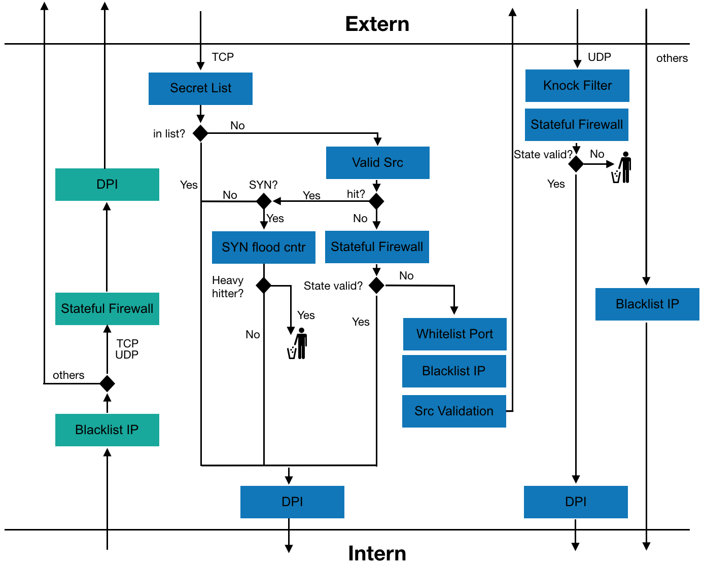
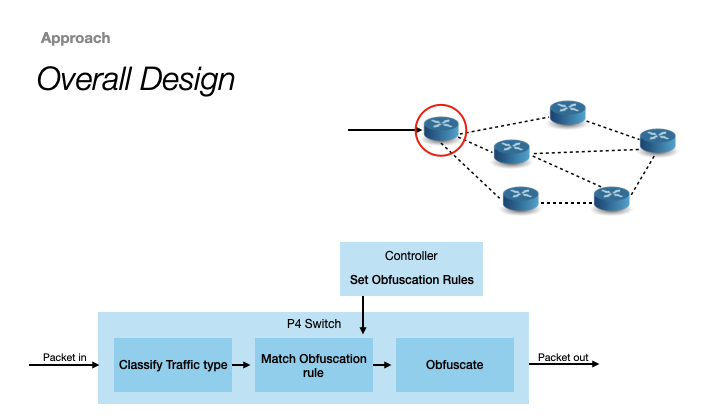
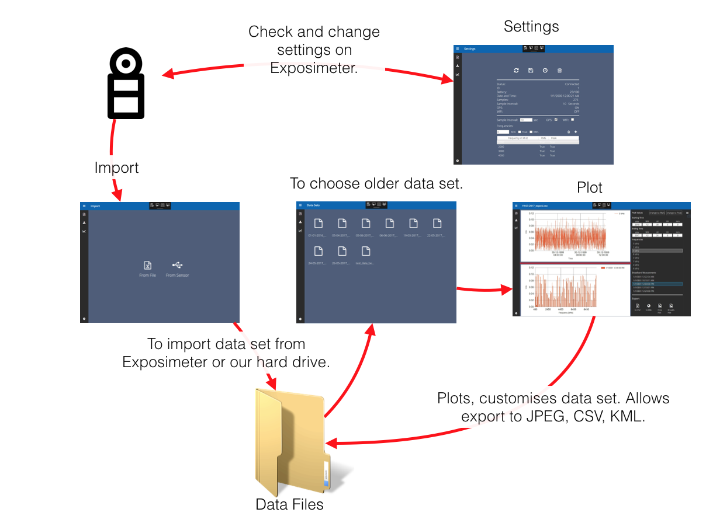
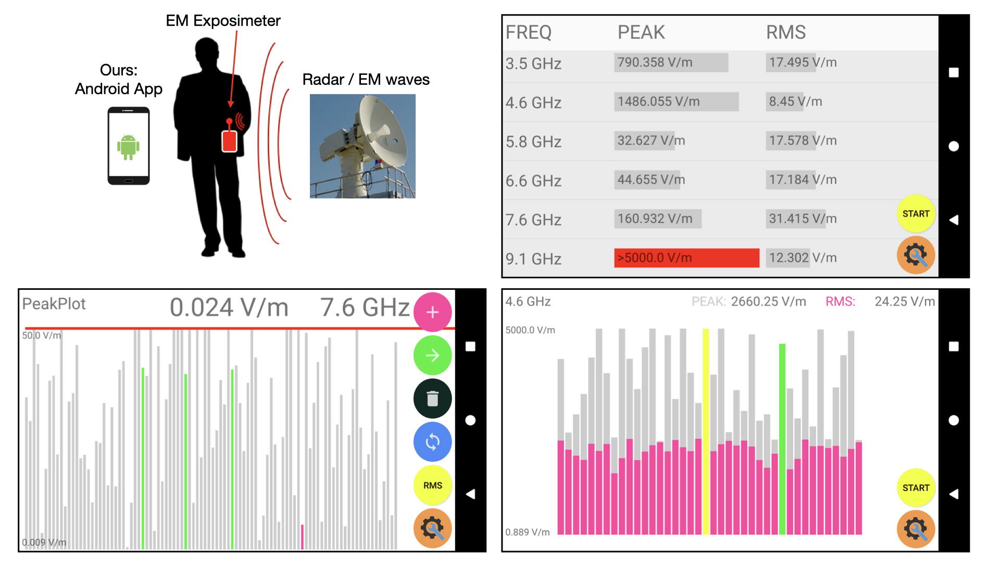

I am a Masters Student at [ETH Zurich](https://ethz.ch/de.html) in Information Technology and Electrical Engineering. I like coding, network and vision stuff.

These are some of my projects.
## Product Managment
Responsible for creating [campusinterview.ch](https://campusinterview.ch), a Web App that allows candidates and companies to match for interviews.
* Worked with remote designer(Bern,CH), developers(Bratislava, SK).
* Agile development (Kanban)
* Main features: Profile, Filter functions, Matching, Chat, Interview scheduling(700 interviews for 1 day), transactional emails, booking system, admin.
* 1000 new annual users.

  

## Advanced Stateful Firewall using P4 (SDN)
Today's "next-generation" firewalls provide enhanced protection by combining information from multiple layers. However, such tasks are usually implemented in the control plane and massively degrade the network throughput. By using p4, we implemented a stateful firewall, extended with SYN-flood attack prevention, deep packet inspection, port knocking, and white-/ blacklists. We showed that parts of a firewall controller can be moved to the hardware and could therefore run at the speed of modern switches. [Repo](https://github.com/Matstah/atcn_project)

  

## Network Performance Obfuscation (Semester Thesis)
Obfuscating network topology or performance makes it harder for an attacker to draw conclusions about the network. My semester thesis focused on detecting performance mesuring traffic and to obfuscate it to specific performance values.

We **obfuscated latency, bandwidth and packet loss** by utilizing recent advances in Software Defined Networks ([P4](https://www.sigcomm.org/sites/default/files/ccr/papers/2014/July/0000000-0000004.pdf)). [Repo](https://github.com/Matstah/network_performance_obfuscation_sa)

  

## Windows App
Windows App to visualize and manage data collected by a electromagnetic exposimeter.

  

## Android App
Android App to control a portable electromagnetic exposimeter.
* Group project during my Bachelors.
* Developed a simple and intuitive frontend with java.

  

## coding exercises
* [Classy computer vision stuff](https://github.com/Matstah/Exercises/tree/main/classy_computer_vision)
* A-Star
* Graph algo
* Search algos / Image retrieval algos
## Master Thesis
todo
## Semester Thesis 2
todo
