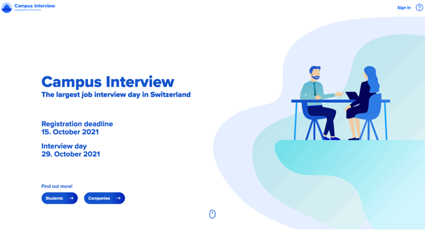

I am a Masters Student at [ETH Zurich](https://ethz.ch/de.html) in Information Technology and Electrical Engineering. I like coding, network and vision stuff.

These are some of my projects.
## Product Managment
Responsible for creating [campusinterview.ch](https://campusinterview.ch), a Web App that allows candidates and companies to match for interviews.
* Worked with remote designer(Bern,CH), developers(Bratislava, SK).
* Agile development (Kanban)
* Main features: Profile, Filter functions, Matching, Chat, Interview scheduling(700 interviews for 1 day), transactional emails, booking system, admin.
* 1000 new annual users.

  

